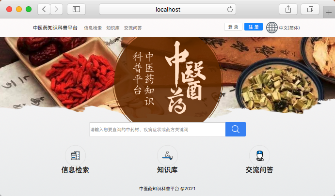
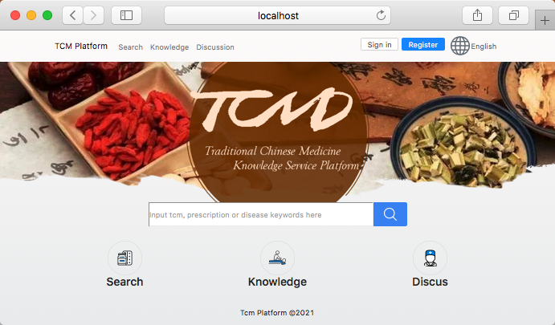
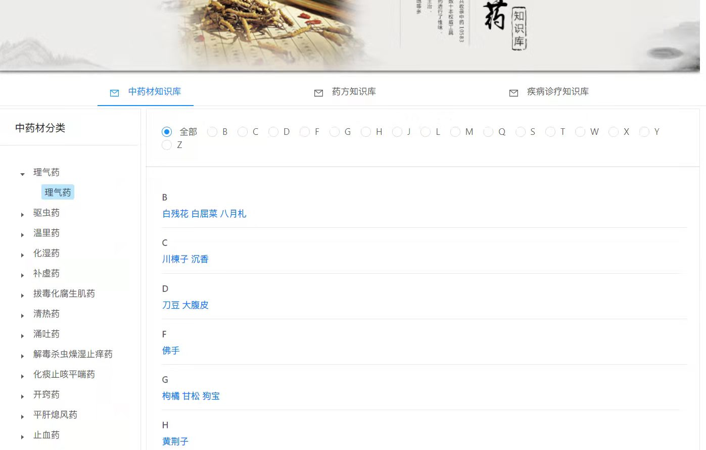
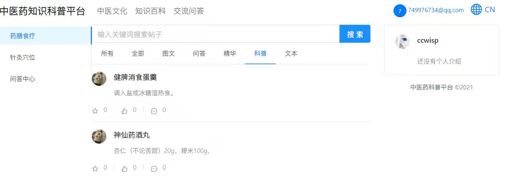

# tcm-web
vue项目, 主要使用了ant-design-vue，bootstrap-vue组件库和vue的其他套件

## Setup
```
npm install
npm run serve
npm run build
```

## Structure
``` bash
tcm-client
├── src
│   ├── api # axios http接口封装
│   ├── assets # 字体 图片等素材
│   ├── components # 构成视图的自定义组件
│   ├── layouts # 各板块视图布局
│   ├── locales # vue-i18n 国际化配置
│   ├── router # vue router 路由配置
│   ├── store # vuex 仓库
│   ├── utils # 工具类
│   └── views # 各板块视图
├── package-lock.json
├── package.json
├── public
└── vue.config.js
```
## Screenshot



